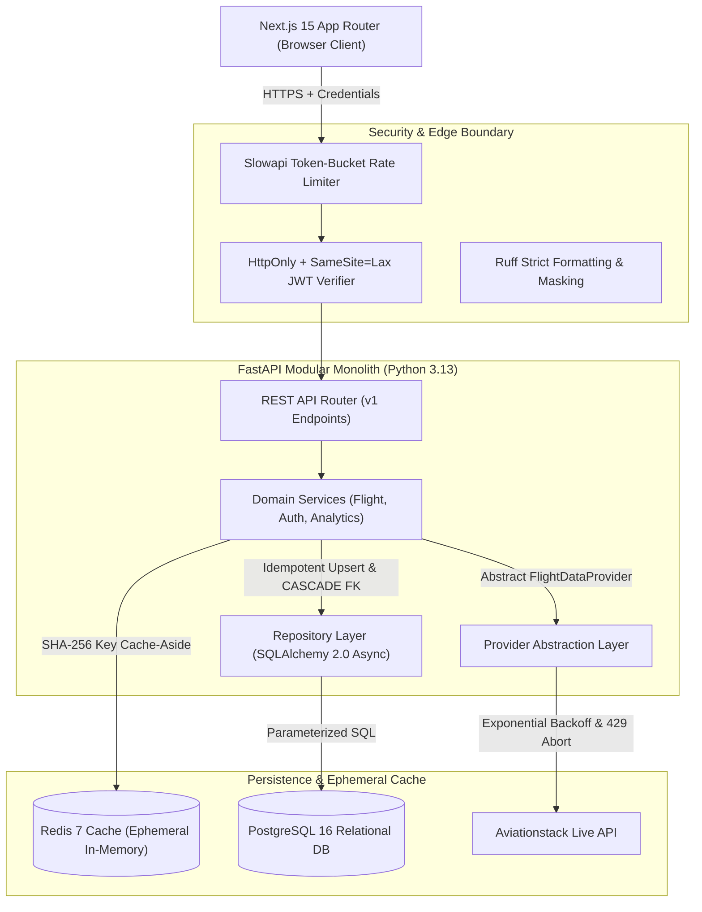

# AeroScope — Aviation Monitoring & Analytics Platform

[](https://github.com/valtzyy/AeroScope/actions/workflows/ci.yml)
[](https://www.python.org/)
[](https://fastapi.tiangolo.com/)
[](https://nextjs.org/)
[](https://www.postgresql.org/)
[](https://redis.io/)
[](https://www.docker.com/)
[](LICENSE)

Platform pemantauan, pelacakan telemetri, dan analitik data penerbangan real-time berbasis data Aviationstack. Dibangun dengan standar rekayasa perangkat lunak enterprise: **Modular Monolith**, proteksi kuota cerdas via **Cache-Aside Redis**, autentikasi **HttpOnly Cookies** dengan hashing **Argon2id**, pemantauan deret waktu telemetri (*time-series observations*), serta arsitektur container aman (*non-root*).

Proyek ini dirancang tidak hanya sebagai portofolio teknis berkualitas tinggi, melainkan juga sebagai **fondasi pembelajaran rekayasa perangkat lunak** yang dilengkapi dokumentasi arsitektur (ADR), buku catatan konsep teknis (*Learning Notes*), dan komentar kode mendalam dalam **Bahasa Indonesia**.

---

## Arsitektur Sistem (High-Level Architecture)



---

## Fitur Utama Platform

1. **Pencarian & Filtering Penerbangan Fleksibel**:
   - Cari berdasarkan nomor penerbangan (IATA/ICAO), nama maskapai, bandara asal, bandara tujuan, tanggal, dan status penerbangan.
   - Paginasi dinamis dan indikator sumber data transparan (*Cache HIT vs Live Provider*).

2. **Detail Penerbangan & Visualisasi Radar Telemetri**:
   - Jadwal keberangkatan dan kedatangan aktual vs estimasi dengan kalkulasi delay otomatis.
   - Data telemetri pesawat: koordinat GPS, altitude, kecepatan horizontal & vertikal, arah kompas (*heading*), dan status di darat (*ground status*).
   - Riwayat observasi telemetri kronologis (*flight observations timeline*).
   - Tombol *Manual Refresh* dengan pembatasan laju (*rate limiting*) untuk menyinkronkan status penerbangan terkini.

3. **Dashboard Statistik & Analitik Jujur**:
   - Ringkasan KPI: *Total Tracked Flights*, *Observed On-Time Rate*, *Observed Delay Rate*, dan *Live Active Flights*.
   - Distribusi status penerbangan (*scheduled, active, landed, cancelled*).
   - *Tracked Flights by Airline* dan *Top Tracked Departure/Arrival Hubs*.
   - Caching analitik agregat selama 60 detik untuk efisiensi kueri database.

4. **Keamanan & Autentikasi Modern**:
   - Token JWT ditransmisikan via **HttpOnly & SameSite=Lax Cookie** (kebal dari pencurian token melalui serangan XSS).
   - Enkripsi password menggunakan algoritma **Argon2id** pemenang Password Hashing Competition.
   - Hak akses pengguna (*Role-Based Access Control*) divalidasi ketat di backend.
   - Mitigasi kerentanan IDOR (*Insecure Direct Object Reference*) pada fitur Favorit dan Riwayat Pencarian.

5. **Proteksi Kuota & Efisiensi Eksternal**:
   - Mode Provider Eksplisit: `FLIGHT_PROVIDER=aviationstack|mock`.
   - *Mock Provider* deterministik yang kaya data untuk pengujian lokal tanpa internet dan tanpa menguras kuota API.
   - Cache-aside otomatis di Redis dengan TTL dinamis:
     - Penerbangan aktif (*active*): 3 menit.
     - Penerbangan terjadwal (*scheduled*): 15 menit.
     - Penerbangan mendarat/batal (*landed/cancelled*): 120 menit.
   - *Circuit-breaker* pembatalan cepat jika API eksternal merespon dengan status kuota habis (HTTP 429).

---

## Struktur Direktori Proyek

```text
Ava/
├── .github/workflows/ci.yml       # GitHub Actions CI (PostgreSQL 16 & Redis 7 services)
├── backend/
│   ├── alembic/                   # Migrasi skema database terkelola
│   │   └── versions/              # Script DDL versioning deklaratif
│   ├── app/
│   │   ├── api/                   # REST API routes & dependency injection
│   │   │   └── v1/routes/         # Endpoints: auth, flights, favorites, history, analytics
│   │   ├── clients/aviation/      # Abstraksi provider (Base, Aviationstack, Mock, Mapper)
│   │   ├── core/                  # Settings, rate limiter, security, logging, metrics
│   │   ├── db/                    # Async session pool & base metadata
│   │   ├── models/                # SQLAlchemy ORM declarative models
│   │   ├── repositories/          # Parameterized SQL query repositories
│   │   ├── schemas/               # Skema validasi Pydantic request/response
│   │   └── services/              # Domain logic (cache-aside, observation, aggregations)
│   ├── tests/                     # Unit & integration tests (22 passing tests)
│   ├── Dockerfile                 # Image Python 3.13-slim non-root user
│   └── requirements.txt           # Dependensi backend yang terkurasi
├── frontend/
│   ├── app/                       # Next.js 15 App Router pages & layouts
│   │   ├── dashboard/             # Dashboard analitik & KPI cards
│   │   ├── favorites/             # Daftar penerbangan tersimpan
│   │   ├── flights/               # Pencarian, filtering, dan detail penerbangan
│   │   ├── history/               # Riwayat pencarian pengguna
│   │   └── (auth)/                # Login & register pages
│   ├── components/                # Komponen UI modular (Navbar, Card, Badges)
│   ├── lib/                       # Types, API client (credentials: include), Auth Context
│   └── Dockerfile                 # Multi-stage image Next.js standalone runner
├── docs/
│   ├── adr/                       # Architectural Decision Records (ADR 001 - 006)
│   ├── architecture.md            # Dokumentasi arsitektur sistem & aliran data
│   ├── authentication.md          # Spesifikasi keamanan cookie JWT & Argon2id
│   ├── database.md                # Dokumentasi skema SQL, indeks, dan diagram relasi
│   └── learning-notes.md          # 25 konsep rekayasa perangkat lunak dalam Bahasa Indonesia
├── docker-compose.yml             # Orkestrasi 4 container (PostgreSQL, Redis, Backend, Frontend)
├── .env.example                   # Template konfigurasi environment
├── pyproject.toml                 # Konfigurasi Ruff & Pytest
└── README.md                      # Dokumentasi utama proyek
```

---

## Panduan Menjalankan Aplikasi

### Metode 1: Menggunakan Docker Compose (Direkomendasikan)

Pastikan Docker Engine dan Docker Compose telah terpasang di komputer Anda.

1. **Clone repositori dan salin environment file**:
   ```bash
   git clone https://github.com/valtzyy/AeroScope.git
   cd AeroScope
   cp .env.example .env
   ```

2. **Konfigurasi file `.env`**:
   Untuk pengembangan lokal cepat, Anda dapat membiarkan nilai default:
   ```env
   APP_ENV=development
   FLIGHT_PROVIDER=mock
   ```
   *(Jika Anda memiliki API Key Aviationstack, ubah `FLIGHT_PROVIDER=aviationstack` dan isi `AVIATIONSTACK_API_KEY=xxx`)*.

3. **Jalankan seluruh layanan**:
   ```bash
   docker compose up --build -d
   ```

4. **Akses aplikasi di browser**:
   - Frontend Web UI: [http://localhost:3000](http://localhost:3000)
   - Backend API Docs (Swagger UI): [http://localhost:8000/docs](http://localhost:8000/docs)
   - Healthcheck & Telemetry: [http://localhost:8000/api/v1/health](http://localhost:8000/api/v1/health)

---

### Metode 2: Menjalankan Secara Lokal (Bare-Metal Development)

#### Prasyarat:
- Python 3.13+
- Node.js 22+
- PostgreSQL 16
- Redis 7

#### Langkah Backend:
```bash
# Buat dan aktifkan virtual environment
python -m venv .venv
# Windows:
.venv\Scripts\activate
# Linux/macOS:
source .venv/bin/activate

# Install dependensi
pip install -r backend/requirements.txt

# Jalankan migrasi database Alembic
alembic -c backend/alembic.ini upgrade head

# Jalankan server FastAPI
uvicorn backend.app.main:app --host 0.0.0.0 --port 8000 --reload
```

#### Langkah Frontend:
```bash
cd frontend
npm install
npm run dev
```

---

## Ringkasan Endpoint API

| Method | Endpoint | Hak Akses | Deskripsi |
| :--- | :--- | :--- | :--- |
| `GET` | `/api/v1/health` | Publik | Status kesehatan sistem, PostgreSQL, Redis, dan metrik API |
| `POST` | `/api/v1/auth/register` | Publik | Pendaftaran pengguna baru (hashing Argon2id) |
| `POST` | `/api/v1/auth/login` | Publik | Login pengguna & penerbitan cookie `access_token` (HttpOnly) |
| `POST` | `/api/v1/auth/logout` | Terautentikasi | Menghapus cookie autentikasi |
| `GET` | `/api/v1/auth/me` | Terautentikasi | Informasi profil pengguna yang sedang aktif |
| `GET` | `/api/v1/flights` | Publik | Pencarian penerbangan (filter nomor, bandara, tanggal) |
| `GET` | `/api/v1/flights/{id}` | Publik | Detail lengkap jadwal & telemetri penerbangan |
| `POST` | `/api/v1/flights/{id}/refresh` | Terautentikasi | Sinkronisasi status penerbangan terkini dari provider |
| `GET` | `/api/v1/flights/{id}/observations`| Publik | Deret waktu telemetri koordinat & ketinggian |
| `GET` | `/api/v1/favorites` | Terautentikasi | Daftar penerbangan favorit milik pengguna |
| `POST` | `/api/v1/favorites` | Terautentikasi | Menambahkan penerbangan ke daftar favorit |
| `DELETE`| `/api/v1/favorites/{id}` | Terautentikasi | Menghapus penerbangan dari daftar favorit |
| `GET` | `/api/v1/history` | Terautentikasi | Riwayat pencarian terbaru pengguna |
| `DELETE`| `/api/v1/history/{id}` | Terautentikasi | Menghapus satu entri riwayat pencarian |
| `GET` | `/api/v1/analytics/overview` | Publik | Statistik agregat KPI, distribusi status, dan top hub |

---

## Pengujian & Kualitas Kode (QA)

Proyek ini dilengkapi pengujian otomatis komprehensif tanpa kompromi mock database:

```bash
# Jalankan linter dan formatter Python (Ruff)
ruff check backend

# Jalankan pengujian unit dan integrasi
pytest backend/tests -v

# Jalankan verifikasi build frontend Next.js
cd frontend && npm run build
```

---

## Dokumentasi Teknis & Pembelajaran

Pelajari lebih lanjut keputusan teknis dan implementasi dalam direktori `/docs`:
- [Buku Catatan Pembelajaran (Learning Notes)](docs/learning-notes.md): Membahas 25 konsep fundamental rekayasa perangkat lunak (*Apa itu? Mengapa digunakan? Apa trade-off-nya?*).
- [Arsitektur Sistem](docs/architecture.md): Pembagian lapisan sistem dan aliran data lengkap.
- [Spesifikasi Keamanan & Autentikasi](docs/authentication.md): Detail implementasi cookie HttpOnly dan Argon2id.
- [Dokumentasi Database](docs/database.md): Struktur skema relasional, indeks komposit, dan relasi tabel.
- [Architectural Decision Records (ADR)](docs/adr/):
  - [ADR 001: Modular Monolith vs Microservices](docs/adr/001-modular-monolith.md)
  - [ADR 002: Flight Data Provider Abstraction](docs/adr/002-provider-abstraction.md)
  - [ADR 003: Real PostgreSQL for Integration Tests](docs/adr/003-postgresql-for-integration-tests.md)
  - [ADR 004: Redis as Ephemeral Cache (No Disk Volume)](docs/adr/004-redis-ephemeral-cache.md)
  - [ADR 005: Cookie-Based Authentication with Argon2id](docs/adr/005-cookie-based-authentication.md)
  - [ADR 006: Cache-Aside Strategy with Dynamic TTL](docs/adr/006-cache-aside-strategy.md)

---

## Lisensi & Kontribusi

Proyek ini dilisensikan di bawah [MIT License](LICENSE).
Dikembangkan dengan standar rekayasa perangkat lunak modern untuk keperluan portofolio profesional dan pembelajaran teknis.
