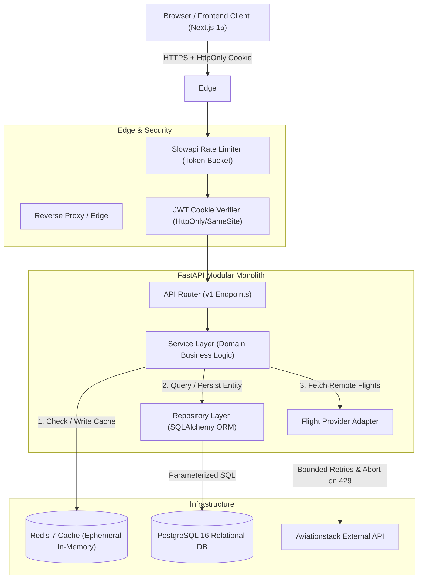
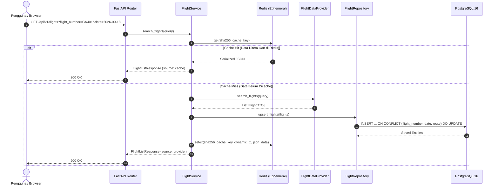

# Arsitektur Sistem — Aviation Monitoring & Analytics Platform

Dokumen ini menjelaskan arsitektur tingkat tinggi, komponen sistem, pemisahan tanggung jawab (separation of concerns), aliran data (*data flow*), strategi caching, serta kontrol keamanan pada **Aviation Monitoring & Analytics Platform**.

---

## 1. Ikhtisar Arsitektur

Platform ini dibangun menggunakan pola **Modular Monolith** dengan arsitektur berlapis (*layered architecture*). Desain ini dipilih untuk mempermudah pengembangan, pengujian, dan pemeliharaan tanpa kompleksitas operasional microservices (seperti distributed tracing, network latency, atau distributed transaction), namun tetap menjaga batas modularitas yang sangat rapi dan siap dipisahkan di masa depan jika beban trafik meningkat.

---

## 2. Lapisan Sistem (System Layers)

Sistem dibagi menjadi lapisan-lapisan independen dengan aturan dependensi satu arah (*unidirectional dependency*):

### A. Presentation Layer (Frontend — Next.js 15 App Router)
- **Teknologi**: Next.js 15, React 19, TypeScript, Tailwind CSS, Lucide Icons, TanStack React Query.
- **Tanggung Jawab**:
  - Menyajikan antarmuka pengguna responsif dengan estetika dark mode bernuansa kokpit penerbangan modern.
  - State management asinkron menggunakan TanStack React Query (`stale-while-revalidate`), mengurangi re-fetch yang berlebihan.
  - Autentikasi transparan via HttpOnly cookies (`credentials: 'include'`), sehingga kode JavaScript di browser tidak menyentuh token JWT.

### B. Transport & Gateway Layer (FastAPI Router & Middlewares)
- **Teknologi**: FastAPI, Slowapi, Starlette Middlewares.
- **Tanggung Jawab**:
  - Serialisasi dan deserialisasi data request/response berbasis skema Pydantic v2 yang ketat.
  - Proteksi laju permintaan (*rate limiting*) berbasis IP client untuk mencegah *denial of service* dan *credential stuffing*.
  - Menolak *payload* yang tidak valid sebelum menyentuh lapisan logika bisnis (*fail-fast input validation*).
  - Formatting response terstandarisasi: `{ "data": ..., "meta": ..., "error": ... }`.

### C. Domain & Service Layer
- **Tanggung Jawab**:
  - Mengorkestrasi aturan bisnis (misalnya: alur pencarian penerbangan dengan strategi cache-aside).
  - Menghitung metrik observasi telemetri (snapshot posisi, kecepatan horizontal/vertikal, altitude).
  - Menghitung analitik operasional agregat dengan label jujur (*Tracked Flights by Airline*, *Observed On-Time Rate*).
  - Melindungi hak akses objek pengguna (*mitigasi IDOR*).

### D. Provider Adapter Layer (External API Abstraction)
- **Tanggung Jawab**:
  - Mengisolasi dependensi vendor pihak ketiga (Aviationstack) menggunakan interface abstrak `FlightDataProvider`.
  - Mengonversi skema respon pihak ketiga yang rapuh atau inkonsisten ke Domain DTO yang kuat dan stabil via `FlightMapper`.
  - Menangani kegagalan jaringan dengan strategi *exponential backoff with jitter* dan *circuit-breaker* sederhana (segera membatalkan request saat kuota habis / HTTP 429).
  - Menyediakan `MockFlightProvider` deterministik untuk pengujian offline dan penghematan kuota gratis.

### E. Persistence Layer (PostgreSQL 16 & Ephemeral Redis 7)
- **PostgreSQL 16**:
  - Sumber kebenaran tunggal (*Single Source of Truth*) untuk data pengguna, penerbangan tersimpan, riwayat pencarian, daftar favorit, dan snapshot observasi telemetri.
  - Integritas relasional dengan *Foreign Key CASCADE* dan *Unique Constraints* (`(flight_number, flight_date, departure_iata, arrival_iata)`).
  - Pengindeksan komposit untuk kueri deret waktu (*time-series timeline*).
- **Redis 7 (Ephemeral)**:
  - Cache kueri pencarian penerbangan berbasis SHA-256 hash.
  - Cache analitik agregat (TTL 60 detik).
  - Berjalan dalam mode murni in-memory (`--save "" --appendonly no`) tanpa beban I/O disk yang tidak perlu.

---

## 3. Aliran Data Utama (End-to-End Data Flow)

### Skenario: Pencarian Penerbangan (Search Flight Flow)

---

## 4. Keamanan & Proteksi Data

1. **Otentikasi Aman**:
   - Token JWT ditransmisikan hanya via cookie ber-atribut `HttpOnly=True`, `SameSite=Lax`, dan `Secure=True` (di production).
   - Menghilangkan sepenuhnya celah pencurian token melalui serangan Cross-Site Scripting (XSS).
2. **Hashing Password Kuat**:
   - Menggunakan algoritma **Argon2id**, standar industri modern yang tahan terhadap serangan GPU cracking dan time-memory trade-off attacks.
3. **Mitigasi IDOR (Insecure Direct Object Reference)**:
   - Setiap penghapusan atau modifikasi data (favorit, history pencarian) memvalidasi `WHERE id = :target_id AND user_id = :current_user_id` secara ketat di repository SQL.
4. **Proteksi Kredensial**:
   - Filter logging mendeteksi dan menyamarkan API keys, password, dan token JWT (`***MASKED***`) sebelum dicetak ke log stream.
   - Pydantic Settings menolak startup aplikasi jika kredensial produksi tidak memenuhi standar keamanan (*fail-fast*).
