# Desain & Dokumentasi Basis Data Relasional

Dokumen ini menjelaskan struktur skema, relasi antar tabel, strategi indeks, dan alasan pemilihan desain basis data pada **Aviation Monitoring & Analytics Platform**.

---

## 1. Diagram Relasi Entitas (ERD)

```mermaid
erDiagram
    USERS ||--o{ FAVORITES : "menyimpan"
    USERS ||--o{ SEARCH_HISTORY : "mencatat"
    FLIGHTS ||--o{ FAVORITES : "ditargetkan"
    FLIGHTS ||--o{ FLIGHT_OBSERVATIONS : "memiliki riwayat"

    USERS {
        uuid id PK "UUID v4 unik global"
        varchar email UK "Email unik terindeks (lowercased)"
        varchar password_hash "Hash password Argon2id"
        varchar name "Nama lengkap tampilan"
        varchar role "Peran: USER atau ADMIN"
        timestamptz created_at "Waktu registrasi (UTC)"
        timestamptz updated_at "Waktu profil diupdate (UTC)"
        timestamptz last_login_at "Waktu login terakhir (UTC)"
    }

    FLIGHTS {
        uuid id PK "UUID v4 internal"
        varchar flight_number "Nomor penerbangan IATA (DL415)"
        varchar flight_date "Tanggal penerbangan YYYY-MM-DD"
        varchar flight_status "Status terkini (active, landed, dsb)"
        varchar airline_name "Nama maskapai"
        varchar departure_iata "Kode IATA bandara asal"
        varchar arrival_iata "Kode IATA bandara tujuan"
        timestamptz departure_scheduled "Jadwal berangkat (UTC)"
        timestamptz arrival_scheduled "Jadwal tiba (UTC)"
        float live_latitude "Posisi lintang terkini"
        float live_longitude "Posisi bujur terkini"
        float live_altitude "Ketinggian terkini (meter)"
        float live_speed "Kecepatan terkini (km/h)"
        timestamptz last_observed_at "Waktu observasi terakhir (UTC)"
    }

    FLIGHT_OBSERVATIONS {
        uuid id PK "UUID v4 unik"
        uuid flight_id FK "Relasi ke flights.id (CASCADE)"
        varchar status "Status saat titik waktu ini"
        float latitude "Koordinat lintang"
        float longitude "Koordinat bujur"
        float altitude "Ketinggian pesawat (meter)"
        float speed "Kecepatan pesawat (km/h)"
        timestamptz observed_at "Waktu observasi provider (UTC)"
        timestamptz created_at "Waktu penyimpanan lokal (UTC)"
    }

    FAVORITES {
        uuid id PK "UUID v4 unik"
        uuid user_id FK "Relasi ke users.id (CASCADE)"
        uuid flight_id FK "Relasi ke flights.id (CASCADE)"
        timestamptz created_at "Waktu disimpan (UTC)"
    }

    SEARCH_HISTORY {
        uuid id PK "UUID v4 unik"
        uuid user_id FK "Relasi ke users.id (CASCADE)"
        json query_parameters "Parameter filter pencarian (JSON)"
        int result_count "Jumlah hasil penerbangan ditemukan"
        timestamptz searched_at "Waktu pencarian dilakukan (UTC)"
    }
```



---

## 2. Mengapa Memisahkan `flights` dan `flight_observations`?

Salah satu keputusan terpenting dalam sistem monitoring adalah membedakan antara:
1. **Kondisi Terkini (*Latest Current State*)** — Tabel `flights`:
   - Digunakan untuk kueri pencarian, filtering, dan tampilan ringkasan kartu penerbangan.
   - Kolom telemetri (`live_latitude`, `live_altitude`) di-update secara idempoten setiap kali ada data baru.
2. **Snapshot Historis (*Time-Series Observations*)** — Tabel `flight_observations`:
   - Setiap kali status atau posisi pesawat diobservasi saat penerbangan aktif, sebuah baris baru ditambahkan.
   - Memungkinkan analisis tren ketinggian (*altitude profile*), kecepatan terhadap waktu (*speed over time*), dan riwayat pergerakan rute.
   - Mengisolasi data time-series agar tabel `flights` tetap ringkas dan cepat dibaca.

---

## 3. Strategi Indeks (Indexing Strategy)

- **`flights`**:
  - `flight_number`, `flight_date`, `departure_iata`, `arrival_iata`, `flight_status`.
  - **Unique Constraint**: `(flight_number, flight_date, departure_iata, arrival_iata)` memastikan tidak ada duplikasi data penerbangan yang sama pada rute dan hari yang sama.
- **`flight_observations`**:
  - **Indeks Komposit**: `(flight_id, observed_at DESC)` memungkinkan pengambilan riwayat telemetri kronologis untuk satu penerbangan dalam waktu O(log N) tanpa memindai seluruh tabel.
- **`search_history`**:
  - **Indeks Komposit**: `(user_id, searched_at DESC)` mempercepat query 10 pencarian terakhir milik user tertentu.
- **`favorites`**:
  - **Unique Constraint**: `(user_id, flight_id)` menjamin pengguna tidak bisa menyimpan penerbangan yang sama dua kali.

---

## 4. Integritas Referensial & Cascading Delete

Seluruh foreign key ke `users.id` dan `flights.id` dikonfigurasi dengan:
```sql
ON DELETE CASCADE
```
Jika pengguna menghapus akunnya, seluruh riwayat pencarian dan daftar favorit miliknya otomatis terhapus tanpa meninggalkan data yatim (*orphaned records*). Begitu pula jika suatu rekaman penerbangan dihapus, seluruh observasi telemetri terkait otomatis dibersihkan.
